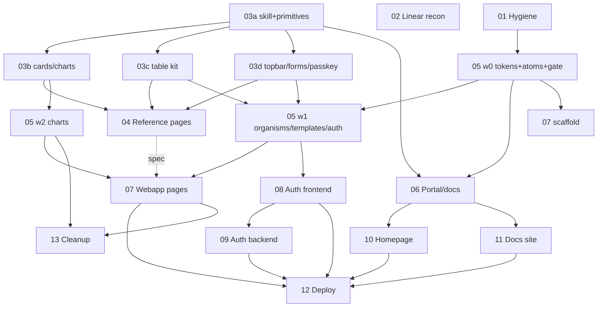

# Open-Tomato PoC Release — Master Plan

> Status: **active** · Authored 2026-07-22 from the planning session driven by [reference/POC-RELEASE-PLANS.md](reference/POC-RELEASE-PLANS.md).
> Each workstream has its own doc (`NN-<name>.md`) with frontmatter: `repo / tier / depends-on / parallel-with / size / status / linear`.
> Linear mirror: **PoC Release** project (Open Tomato team) — issues OPT-240…OPT-252 map WS01…WS13; OPT-239 is the orchestrator-test quarantine record. WS01 + WS02 completed 2026-07-22.

## Repos

| Key | Repo | Local path |
|-----|------|-----------|
| OT | open-tomato monorepo | `/Users/marcos/projects/open-tomato/open-tomato` |
| CB | component-breakdown (`@open-tomato/pre-components`) | `/Users/marcos/projects/open-tomato/component-breakdown` |
| GB | grow-box | `/Users/marcos/projects/open-tomato/grow-box` |

Pipeline: **raw design system → CB (breakdown/fidelity) → OT `packages/ui/*` (published libs) → OT apps → GB (deploy)**. Published `@open-tomato/ui-*` packages must contain **zero references** to the raw design system or component-breakdown.

## Check-in summary (2026-07-22)

- **CB done**: 27 atoms, 16 molecules, organisms (Table/Toolbar/FormKit/CommandPalette), AppShell + AuthShell, all 10 auth pages — rosetta-verified. Dashboard pages are thin stubs vs rich raw-DS sources; topbar set exists only as story fixtures; portal kit unmigrated.
- **OT**: `packages/ui/components` (`@open-tomato/ui-components@0.6.0`) is an empty scaffold, not in workspace globs; `packages/ui-skeleton` is the legacy low-fidelity predecessor (to be removed, never a source); all four PoC apps greenfield; publish gate (`publish:dry`) currently weakened by disabled orchestrator tests; CLI rename changesets pending.
- **GB**: phases 0–6 done; Phase-7 `service.config.yaml` onboarding seam built + parity-verified but never used by a real service; prebuilt images only, local target only, stage env no-op.
- **Linear**: reconciliation pending an issue-capable connection (WS02).

## Decision log

| # | Decision | Outcome |
|---|----------|---------|
| D1 | LineChart | **RESOLVED 2026-07-22 (WS03b, CB PR #10)**: hand-rolled token-styled SVG — raw-DS reference is itself ~90 lines of SVG; zero new deps; revisit triggers (zoom/brush/animation/dense tooltips → evaluate headless visx/d3-scale) recorded in `LineChart/D1-DECISION.md` |
| D2 | ui package versioning | Changesets **fixed/linked group**: ui-components, ui-portal, ui-docs, theme-default move together at 0.x |
| D3 | Theming | Tokens + Tailwind preset extracted to `@open-tomato/theme-default` in WS05 wave 0; consumed by all ui packages + apps |
| D4 | Reference-free enforcement | ESLint `no-restricted-imports` + grep gate over `packages/ui/**` wired into `publish:dry` + story-source scrub in port checklist |
| D5 | Passkey | Design exists: `PasskeyPrompt` in CB `demo/raw-design-system/dashboard/Profile.jsx` (raw DS settings.html) — shown after "add passkey" in the 2FA modal, then awaits browser WebAuthn interaction. Migrate in WS03d, wire in WS08; backend WebAuthn = WS09 milestone candidate |
| D6 | Visual baselines | Never copy jest-image-snapshot baselines across repos; regenerate per package in OT; one-time cross-repo fidelity check at port time |
| D7 | Pages placement | Auth screens ship in ui-components as templates; dashboard pages live only in `/app`; CB reference pages stay internal spec artifacts |
| D8 | Portal/docs | FULL portal migration into new `@open-tomato/ui-portal` + `@open-tomato/ui-docs`, each cloned from `packages/ui/components` boilerplate |
| D9 | ui-skeleton | Removed after port (WS13); never a component source — only conventions carried over |
| D10 | App layout | Grow `/app` + sibling app workspaces ad hoc (no `apps/*` restructure) |

## Workstreams

| WS | Doc | Repo | Tier | Size | Depends on |
|----|-----|------|------|------|-----------|
| 01 | [Monorepo hygiene & release baseline](01-monorepo-hygiene.md) | OT | milestone | S | — |
| 02 | [Linear roadmap reconciliation](02-linear-reconciliation.md) | Linear | milestone | S | this plan |
| 03 | [Dashboard component catalog](03-dashboard-components.md) | CB | detailed | L | 03a first; D1 for 03b |
| 04 | [Dashboard reference pages](04-dashboard-reference-pages.md) | CB | detailed | M–L | 03b–d |
| 05 | [ui-components + theme-default port & publish](05-ui-components-port.md) | OT | detailed | L | 01; waves 1–2 on 03 |
| 06 | [Portal & docs pipeline](06-portal-docs-pipeline.md) | CB→OT | detailed | M–L | 05 w0, 03a |
| 07 | [Webapp frontend](07-webapp-frontend.md) | OT | detailed | L | 05 waves; 04 as spec |
| 08 | [Auth app frontend + API contract](08-auth-frontend.md) | OT | detailed | M | 05 w1 |
| 09 | [Auth backend](09-auth-backend.md) | OT | milestone | L | 08 contract |
| 10 | [Homepage app](10-homepage.md) | OT | milestone | S | 06 |
| 11 | [Docs site](11-docs-site.md) | OT | milestone | M | 06 |
| 12 | [grow-box deployment](12-growbox-deployment.md) | GB+OT | milestone | M | any buildable app |
| 13 | [Cleanup](13-cleanup.md) | OT | milestone | S | 05, 07 |

## Dependency graph

**Critical path:** 03c/03d → 05 wave 1 → 07/08 → 09 → 12.

**Start immediately in parallel:** WS01, WS02, WS03a, WS05-wave-0 (wave 0 does *not* wait for WS03 — atoms/molecules are already complete in CB). Run the WS12 pilot early (Homepage or placeholder image) to burn down the untested Phase-7 seam.

## Session phases (~18–22 sessions)

| Phase | Concurrent tracks |
|-------|-------------------|
| P0 | 01 · 02 · 03a · 05-w0 |
| P1 | 03b/03c/03d (CB) · 06-breakdown · 07-scaffold · 12-pilot |
| P2 | 05-w1 · 04 · 06-port |
| P3 | 07 pages (≈3 sessions) · 08 · 05-w2 · 10 · 11 |
| P4 | 09 · 12 full · 13 |

## Verification map

| WS | How |
|----|-----|
| 01 | `bun run publish:dry` green across all workspaces; changesets installable from Verdaccio |
| 03/04/06 (CB) | existing loop: `compare-design.mjs`, `check-stories.mjs`, `test-visual.sh` (grow-box runner), rosetta verification |
| 05/06 (port) | one-time cross-repo fidelity check → regenerate baselines in OT → visual regression + reference-free gate (D4) → `publish:local` + install-from-registry smoke test |
| 07/08 | turbo gate; Vite build + Vitest page smoke; manual pass vs WS04 reference pages; auth flow state-machine unit tests |
| 09 | contract tests vs `auth-api-contract.md`; service-framework conventions |
| 10/11 | build + link check; docs regeneration idempotency |
| 12 | grow-box sandbox e2e: `service.config.yaml` → stack materializes → app reachable |
